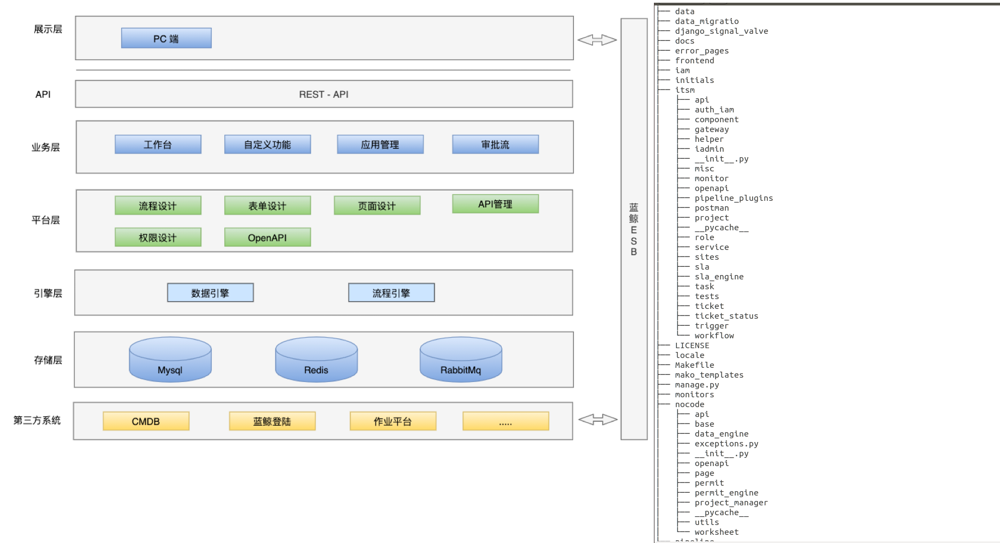

# 代码目录

- framework

  蓝鲸基于 django 框架的二次封装架构，主要提供 SaaS 运营在蓝鲸 PaaS 上的基础配置和服务。

  config：工程各部署环境配置，如本地环境、测试环境、正式环境，以及路由配置。

  blueapps：新版开发框架核心模块，包括蓝鲸统一登录、鉴权、中间件和公共函数。

  blueking：蓝鲸 API SDK，包括配置平台、作业平台等提供的API。

- engine

  pipeline: 自研的流程引擎框架，主要包含任务流程编排页面和任务流程执行服务。
  data_engine： 数据引擎，主要用于用户数据操作。
  
- itsm

  业务适配层，包含业务权限控制、流程管理、任务管理、服务管理，单据管理等模块。
  iadmin：提供系统配置，自定义通知等管理能力。
  gateway：第三方接口在itsm的二次封装层。
  openapi：itsm 网关接口提供层。
  postman：Api管理。
  role：角色管理。
  service：服务管理。
  sla：sla管理。
  project：项目管理。
  task: 任务管理。
  ticket: 单据管理。
  trigger: 触发器管理。
  workflow: 流程管理。

- nocode

  业务适配层，包含页面规划，表单设计，应用白名单，页面权限控制等。data_engine: 表单数据引擎。
  openapi：s-maker api网关接口提供层。page：页面规划管理。permit：权限控制。project_manger: 应用管理。worksheet：表单设计

- web

  前端资源，包括 webpack 配置和静态资源。

  frontend：主要包括pc与weixin模块，该模块是使用vue实现的

  static： 静态文件存放的目录。

  templates：包含首页和 django admin 需要的页面。

  locale：国际化翻译文件。
