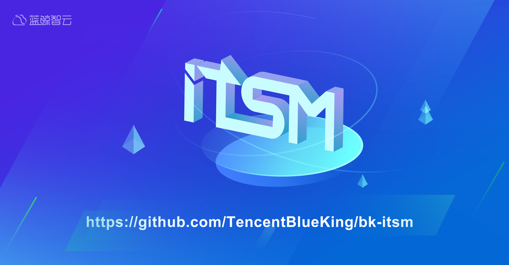
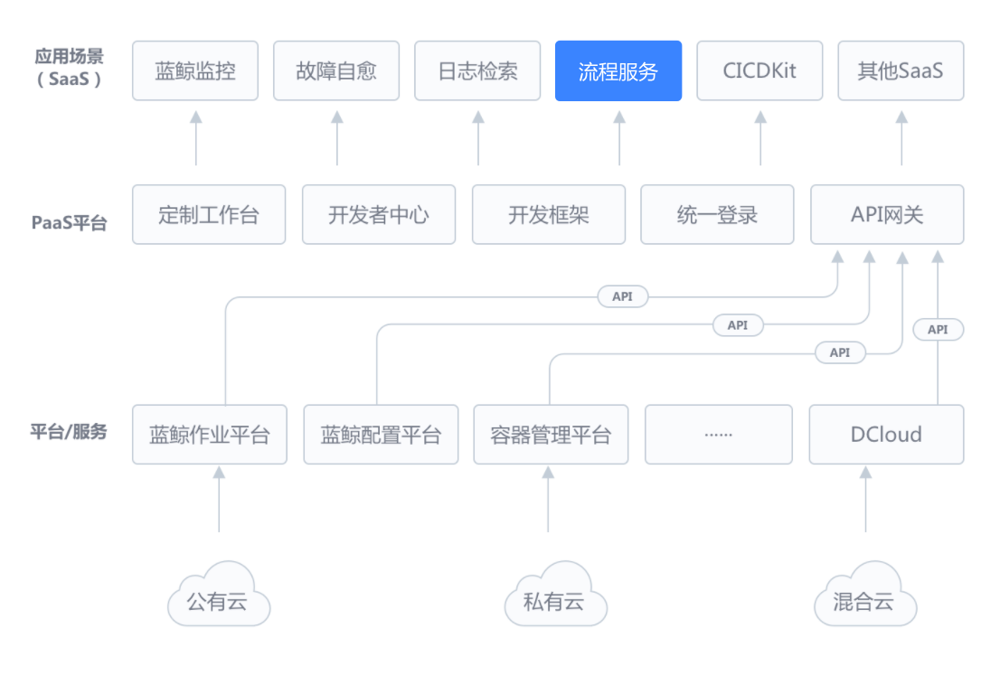
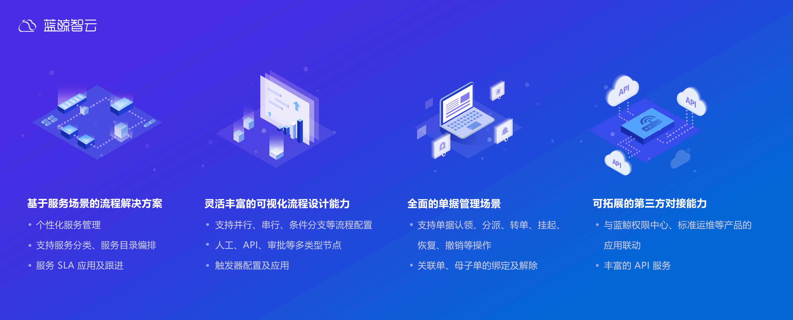
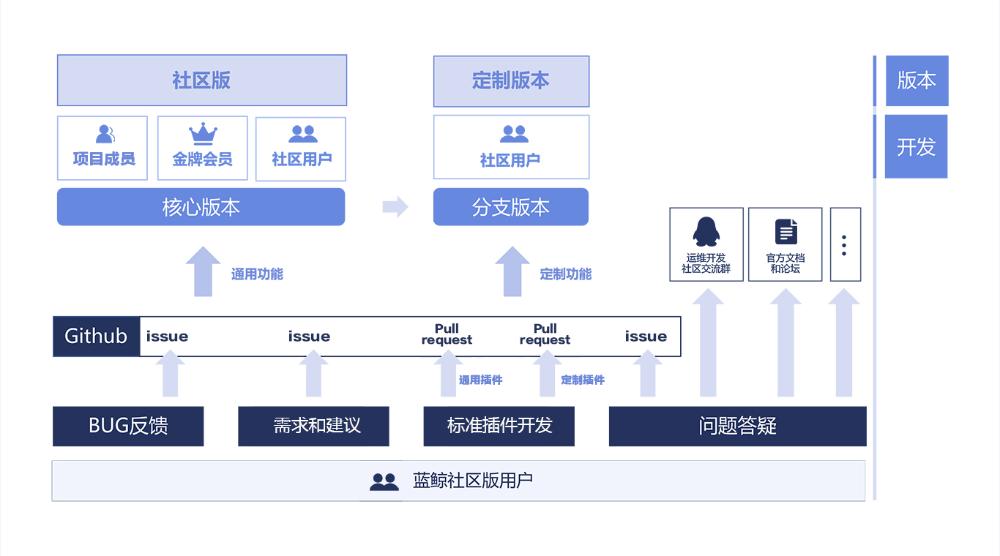
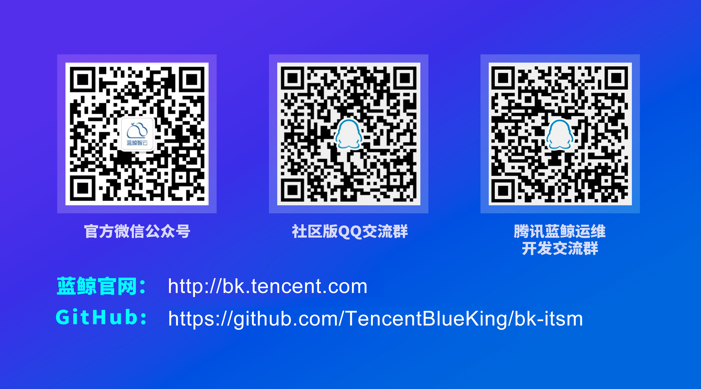
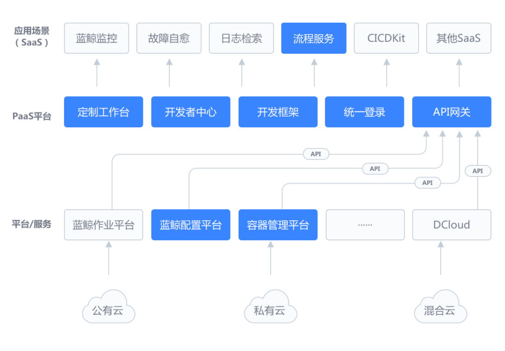

# S-Maker, 更高效的无代码开发系统！

## 导读
>无代码开发平台（S-Maker），是在蓝鲸智云体系的上基于ITSM（流程服务）能力上升级的SaaS应用。能够通过可视化建表，无代码搭建功能流程和页面，迅速开发部门级轻量应用，实现需求快速响应的无代码开发平台。
无代码开发平台（S-Maker）通过可视化建模，流程敏捷搭建，业务人员也可自助搭建管理应用，减轻IT部门负担，实现需求快速响应， 维持应用高可用状态。

## 功能特性

## 定位
腾讯蓝鲸智云根据日常中各个不同部门的应用需求，将业务场景沉淀与以下四个方向：
- 数据管理：管理部门中各种类型数据，包括但不限于资产数据、问卷数据、合同数据等。
- 数据分析：分析业务数据，搭建运营报表、工作报表、项目看板，辅助部门决策。
- 工作审批：集成表单与流程，通过规范化流程把控数据出入口。
- 自定义页面：提供表单、表格类型页面快速搭建应用页面，用于呈现和管理业务数据。

S-Maker基于ITSM能力进行升级，将审批流与数据处理相融合，并提供了成熟的api节点，能够多方位实现数据管理、分发场景，有效杜绝数据管理中数据孤岛情况的产生。

## 价值
“S-Maker”是以ITSM流程服务作为核心能力进行升级打造的无代码开发平台，专注为“有流程审批需求“和“数据管理需求”的用户，能够解决传统业务模式应用产生的“信息难协同”、“需求反应慢”、“人工效率低”、“数据孤岛”等痛点。
主要服务对象及服务内容：
1. 面向服务使用方：不仅仅是应用的使用者，也能成为应用管理者，快速搭建出自己的意向应用；
2. 面向服务管理方：负责应用数据建模、流程设计和页面设计，无需写一行代码就能搭建出多种场景的业务应用；
3. 面向系统调用方：应用表单的接口开放能够自主调用自己想要的数据。
4. 
## 未来
我们希望通过开源，能够促进IT运维圈子同仁的凝聚力，共同构建一个友好、活跃的社区；相信大家的加入和共同陪伴一定可以使这个大生态社区变得更加强大、优秀。

## 关于开源协议
流程服务管理采用的是MIT开源协议。MIT是和BSD一样宽范的许可协议，作者只想保留版权，而无任何其他的限制。使用者必须在发行版里包含原许可协议的声明，无论是以二进制发布的还是以源代码发布的。

## 欢迎一起交流

## 腾讯蓝鲸智云
腾讯蓝鲸智云体系由平台级产品和通用 SaaS 服务组成，平台包括管控平台、配置平台、作业平台、PaaS 平台等，通用 SaaS 包括节点管理、标准运维、日志检索、蓝鲸监控、故障自愈等，为各种云（公有云、私有云、混合云）的用户提供不同场景、不同需求的一站式技术运营解决方案。

腾讯蓝鲸体系产品架构图-社区版  

说明：  
1、腾讯蓝鲸是一个体系化产品，需要各产品整体配合使用，才能发挥最大的功能价值；  
2、社区版中，目前开源的产品有：配置平台、PaaS平台、标准运维；  
3、配置平台、PaaS平台可以作为原子平台单独部署使用；  
4、流程服务必须跟整个体系配合使用。

开源产品链接  
流程服务：https://github.com/TencentBlueKing/bk-itsm
PaaS平台：https://github.com/Tencent/bk-PaaS  
配置平台：https://github.com/Tencent/bk-cmdb  
容器管理平台：https://github.com/Tencent/bk-bcs  
