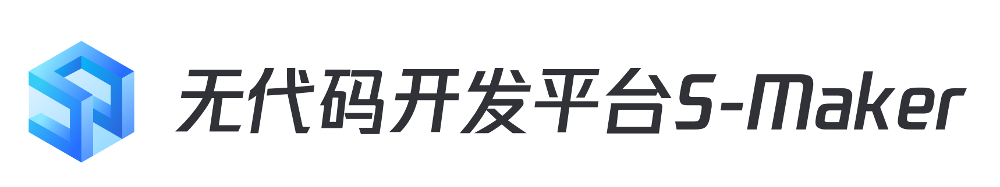

# 蓝鲸低代码平台

---

[(English Documents Available)](readme_en.md)

可视化开发平台（**S-marker**），是基于ITSM能力提供可视化建表，无代码搭建功能流程和页面，迅速开发部门级轻量应用， 实现需求快速响应的无代码开发平台。

可视化开发平台（**S-marker**），是基于ITSM体系架构设计及开发。为用户提供快速交付部门需求的能力，以满足用户的不同的业务场景。同时，提供第三方对接能力，供用户可以调度蓝鲸体系中其它平台或服务能力的同时（配置平台，标准运维、ESB等），也能根据用户自身诉求实现与第三方服务的对接，降低沟通成本，提升流转效率。

**S-marker**后台使用 Python 作为开发语言，使用 Django 开发框架；前端使用 Vue 开发页面，通过前后端分离式的开发模式，在提供美观交互性强的界面的同时，提升整体的开发效率。

## Overview

- [设计理念](docs/overview/design.md)

- [架构设计](docs/overview/architecture.md)

- [代码目录](docs/overview/code_structure.md)

## Feature
**S-marker**(可视化开发平台)是一套帮助企业对 IT 系统的规划、研发、实施和运营进行有效管理的方法论。无代码开发是这几年新兴的一种软件开发方式。在众多类型的快速开发平台中，无代码开发平台比低代码开发和传统开发软件，在使用群体和开发效率两个方面存在很大的优势。低代码开发平台是以追求界面交互优先的开发方式，程序员编写少量代码，提高了开发效率，低代码开发比传统开发效率高3-5倍。而无代码开发比低代码开发效率高3-5倍，比传统开发快10-30倍。

蓝鲸智云 **S-marker**(可视化开发平台)，是基于蓝鲸智云体系的上层 SaaS 应用。通过可自定义设计的流程模块，覆盖不同管理活动或应用场景。帮助用户大幅度降低软件项目交付的各种成本，加快交付时间，并且最高限度的保证了项目的成功率。

## Getting started  
- [开发环境部署](docs/install/dev_deploy.md)
- [正式环境源码部署](docs/install/source_code_deploy.md)
- [正式环境上传部署](docs/install/upload_pack_deploy.md)

## Usage
- [API使用说明](docs/itsm_bkapi/apidocs/readme.md)

## Version plan
- [版本日志](docs/RELEASE.md)
[(English Documents Available)](docs/RELEASE_EN.md)

## Support
- [源码](https://github.com/TencentBlueKing/bk-itsm)
- [wiki](https://github.com/TencentBlueKing/bk-itsm/wiki)
- [白皮书](https://bk.tencent.com/docs/document/6.0/145/6623)
- [蓝鲸论坛](https://bk.tencent.com/s-mart/community)
- [蓝鲸 DevOps 在线视频教程](https://cloud.tencent.com/developer/edu/major-100008)
- 联系我们，加入腾讯蓝鲸运维开发交流群：878501914

## BlueKing Community

- [BK-CMDB](https://github.com/Tencent/bk-cmdb)：蓝鲸配置平台（蓝鲸 CMDB）是一个面向资产及应用的企业级配置管理平台。
- [BK-CI](https://github.com/Tencent/bk-ci)：蓝鲸持续集成平台是一个开源的持续集成和持续交付系统，可以轻松将你的研发流程呈现到你面前。
- [BK-BCS](https://github.com/Tencent/bk-bcs)：蓝鲸容器管理平台是以容器技术为基础，为微服务业务提供编排管理的基础服务平台。
- [BK-BCS-SaaS](https://github.com/Tencent/bk-bcs-saas)：蓝鲸容器管理平台 SaaS 基于原生 Kubernetes 和 Mesos 自研的两种模式，提供给用户高度可扩展、灵活易用的容器产品服务。
- [BK-PaaS](https://github.com/Tencent/bk-PaaS)：蓝鲸 PaaS 平台是一个开放式的开发平台，让开发者可以方便快捷地创建、开发、部署和管理 SaaS 应用。
- [BK-SOPS](https://github.com/Tencent/bk-sops)：标准运维（SOPS）是通过可视化的图形界面进行任务流程编排和执行的系统，是蓝鲸体系中一款轻量级的调度编排类 SaaS 产品。

## Contributing
如果你有好的意见或建议，欢迎给我们提 Issues 或 Pull Requests，为蓝鲸开源社区贡献力量。关于标准运维分支管理、Issue 以及 PR 规范，
请阅读 [Contributing Guide](docs/CONTRIBUTING.md)。

[腾讯开源激励计划](https://opensource.tencent.com/contribution) 鼓励开发者的参与和贡献，期待你的加入。

## FAQ
[FAQ](docs/wiki/faq.md)

## License
**S-marker**是基于 MIT 协议， 详细请参考 [LICENSE](LICENSE.txt) 。
