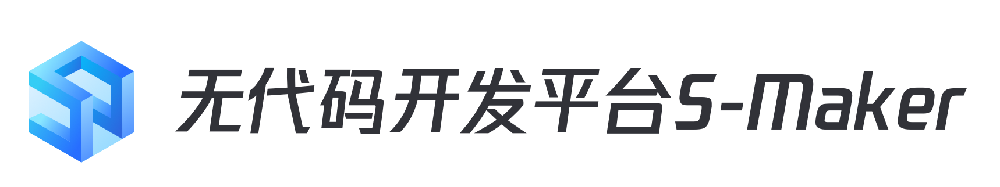

# ITSM

---

[(English Documents Available)](readme_en.md)

Visual development platform **S-marker**, is a low code development platform for rapid design and development of applications. It provides visual table creation, data management, business process management, page design, authority control and other functions. Users can quickly develop department level lightweight applications through * * s-marker * * according to different business scenarios to realize rapid response to business needs. At the same time, through process management, it can quickly realize the connection with the third-party system. It not only has the ability to dispatch the basic platform services in the blue whale system (configuration platform, standard operation and maintenance, ESB, etc.), but also can connect the third-party services outside the blue whale system according to the needs of users, so as to reduce the communication cost, improve the circulation efficiency and open up the enterprise stock system.
## Overview

- [Design Concept(In Chinese)](docs/overview/design.md)

- [Architecture Design (In Chinese)](docs/overview/architecture.md)

- [Code Directory (In Chinese)](docs/overview/code_structure.md)

## Feature
Visual development platform **S-marker**, is a low code development platform for rapid design and development of applications. It provides visual table creation, data management, business process management, page design, authority control and other functions. Users can quickly develop department level lightweight applications through * * s-marker * * according to different business scenarios to realize rapid response to business needs. At the same time, through process management, it can quickly realize the connection with the third-party system. It not only has the ability to dispatch the basic platform services in the blue whale system (configuration platform, standard operation and maintenance, ESB, etc.), but also can connect the third-party services outside the blue whale system according to the needs of users, so as to reduce the communication cost, improve the circulation efficiency and open up the enterprise stock system.
## Getting started  
- [Development Environment Deployment(In Chinese)](docs/install/dev_deploy.md)
- [Production Source Code Deployment (In Chinese)](docs/install/source_code_deploy.md)
- [Production Upload Deployment (In Chinese)](docs/install/upload_pack_deploy.md)

## Usage
- [API Usage Instructions](docs/itsm_bkapi/apidocs/readme.md)

## Version plan
- [RELEASE](docs/RELEASE_EN.md)
[(Chinese Documents Available)](docs/RELEASE.md)

## Support
- [Source Code](https://github.com/TencentBlueKing/bk-itsm)
- [Wiki](https://github.com/TencentBlueKing/bk-itsm/wiki)
- [White paper(In Chinese)](https://bk.tencent.com/docs/document/6.0/145/6623)
- [BK forum](https://bk.tencent.com/s-mart/community)
- [BK DevOps online video tutorial(In Chinese)](https://cloud.tencent.com/developer/edu/major-100008)
- Contact us, technical exchange QQ group：878501914

## BlueKing Community

- [BK-CI](https://github.com/Tencent/bk-ci)：BlueKing Continuous Integration is a continuous integration and continuous delivery system that can easily present your R & D process to you.
- [BK-BCS](https://github.com/Tencent/bk-bcs): BlueKing Container Service is an orchestration platform for microservices based on container technology.
- [BK-BCS-SaaS](https://github.com/Tencent/bk-bcs-saas): SaaS of BlueKing Container Service is based on two modes, the native Kubernetes mode and the Mesos self-developed mode. It provides highly scalable, flexible and easy-to-use container management service for users.
- [BK-CMDB](https://github.com/Tencent/bk-cmdb): BlueKing Configuration Management DataBase (BlueKing CMDB) is an enterprise level configuration management platform for assets and applications.
- [BK-PaaS](https://github.com/Tencent/bk-PaaS): BlueKing PaaS is an open development platform that allows developers to create, develop, deploy and manage SaaS applications quickly and easily.
- [BK-SOPS](https://github.com/Tencent/bk-sops): BlueKing Standard OPS (SOPS) is a light-weighted SaaS product in the Tencent BlueKing product system designed for the orchestration and execution of tasks through a graphical interface.

## Contributing
If you have good ideas or suggestions, please let us know by Issues or Pull Requests and contribute to the Blue Whale Open Source Community. For Standard SOPS branch management, issues, and pr specifications, read the
[Contributing Guide](docs/CONTRIBUTING.md)。

If you are interested in contributing, check out the [CONTRIBUTING.md], also join our。[Tencent OpenSource Plan.](https://opensource.tencent.com/contribution) 

## FAQ
[FAQ](docs/wiki/faq.md)

## License
ITSM is based on the MIT protocol. Please refer to LICENSE for details. [LICENSE](LICENSE.txt) 。

